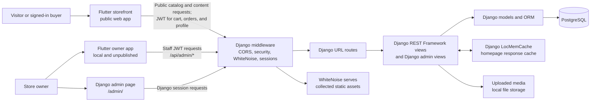
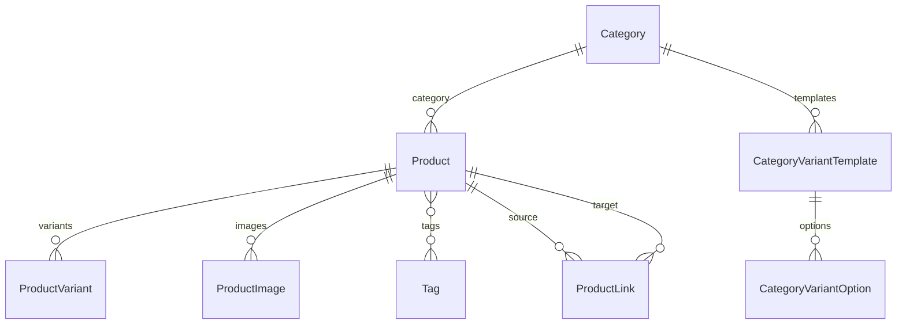
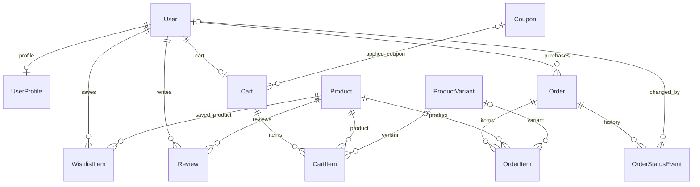
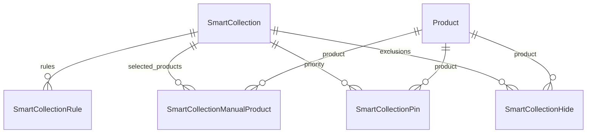
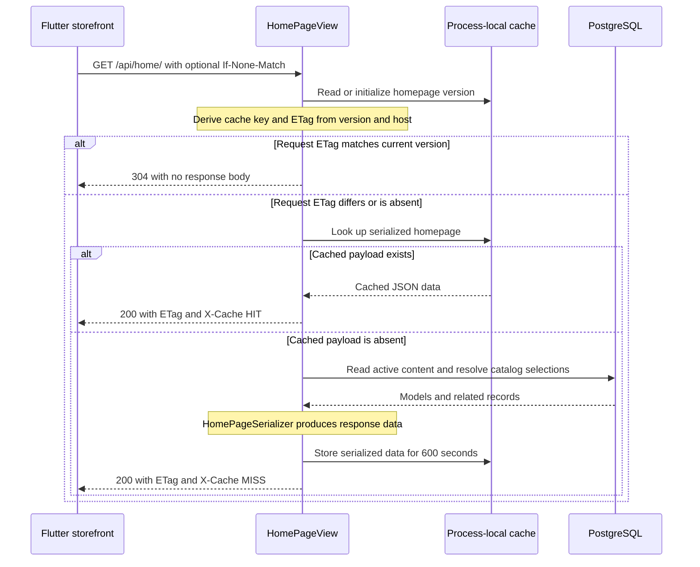
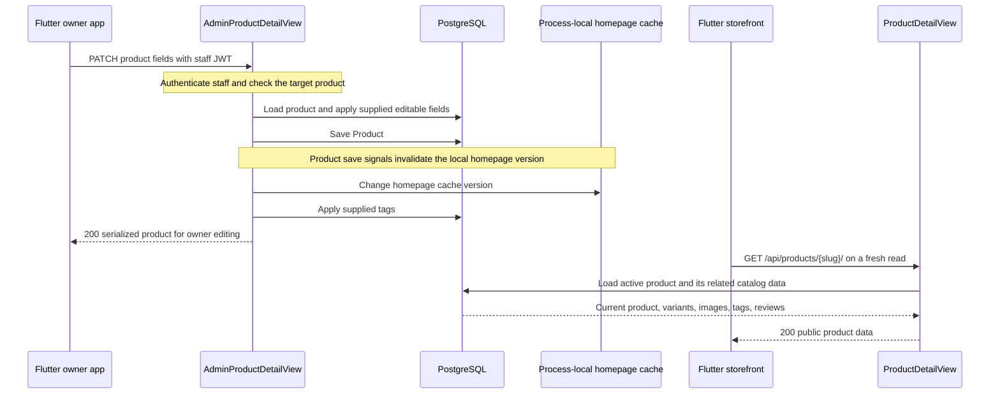
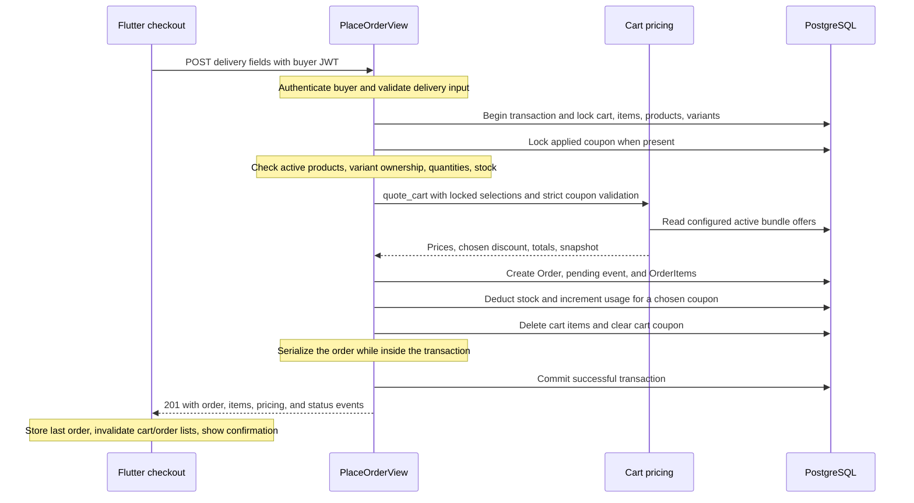
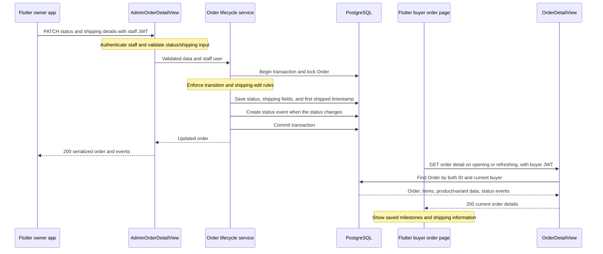
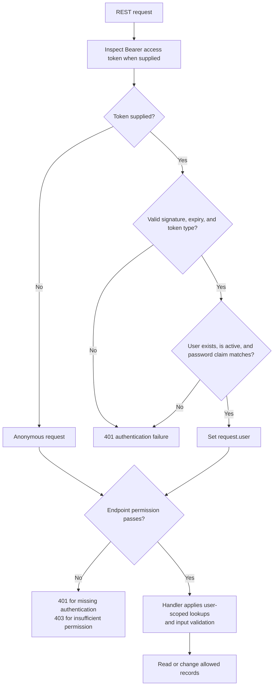

# Pebble backend architecture

Flutter storefront and owner app backed by Django REST Framework and PostgreSQL.

The project owner confirms that the latest backend and Flutter storefront code have both been pushed to GitHub and deployed. Their local and deployed code versions match. The Flutter owner app remains unpublished. Deployment settings and the live database were not checked.

The [detailed reference](PEBBLE_BACKEND_ARCHITECTURE_DETAILED.md) contains the complete route inventory, additional explanations, source pointers, and verification notes.

### Contents

1. [System diagram](#1-system-diagram)
2. [Folder map](#2-folder-map)
3. [Data relationships](#3-data-relationships)
4. [API groups](#4-api-groups)
5. [Four request traces](#5-four-request-traces)
6. [Authentication and permissions](#6-authentication-and-permissions)
7. [Storage and cache](#7-storage-and-cache)

## 1. System diagram



The storefront reads public product, collection, home, and content endpoints. Signed-in buyers use protected profile, cart, order, and wishlist endpoints. The owner's separate Flutter app sends staff-authenticated requests to `/api/admin/`; the built-in Django admin is another owner interface. Django models read and write PostgreSQL. Homepage responses can come from an in-process cache. Uploaded media uses Django's configured file storage, while WhiteNoise handles collected static assets.

## 2. Folder map

Main folders and files, relative to the backend repository root. Individual tests and migrations are omitted.

```text
pebble_backend/
├── requirements.txt            Python dependencies
└── pebble/                    Django working directory
    ├── manage.py              Django command entry point
    ├── build.sh               Install dependencies, collect static files, migrate
    ├── .env.example           Example environment variables (no secrets)
    ├── pebble/                Django project configuration
    │   ├── settings.py        Installed apps, database, auth, cache, storage
    │   ├── env.py             Local environment-file reader and helpers
    │   ├── urls.py            Top-level API and /admin/ route groups
    │   ├── wsgi.py            WSGI server entry point
    │   ├── asgi.py            ASGI server entry point
    │   └── test_settings.py   Isolated test configuration
    ├── accounts/              Registration, login, profile, password reset
    ├── products/              Products, categories, variants, images, reviews
    ├── merchandising/         Smart/manual collections and rule engine
    │   └── services/engine.py Resolve collection rules, ordering, pins
    ├── cart/                  Buyer cart, coupon application, pricing quotes
    │   └── pricing.py         Cart totals, coupon and bundle pricing
    ├── coupons/               Coupon model used by cart, orders, owner API
    ├── orders/                Checkout, order history, status and tracking
    │   └── lifecycle.py       Store-side order status transitions
    ├── wishlist/              Saved products for signed-in buyers
    ├── home/                  Homepage sections, settings, newsletter
    │   └── signals.py         Homepage cache invalidation hooks
    ├── content/               Pages, articles, and storefront search
    ├── admin_api/             Staff-only REST endpoints for Flutter owner app
    │   ├── views.py           Catalog, orders, customers, dashboard, etc.
    │   ├── page_views.py      Owner page editing
    │   ├── catalog_content_views.py  Editorial and product-link editing
    │   └── urls.py            /api/admin/ route definitions
    └── scripts/               Local owner/buyer walkthrough scripts
```

Most domain apps use `models.py` for database tables, `serializers.py` for API data, `views.py` for request handling, `urls.py` for their routes, `admin.py` for Django admin configuration, `migrations/` for schema changes, and test files for checks. Some apps have only the files they need. `admin_api/` is routed from `pebble/urls.py` but is not listed in `INSTALLED_APPS`; its `models.py` is empty. `coupons/` is installed, but has no separate URL group: cart and owner endpoints use its model.

The `home/`, `products/`, and `content/` apps also contain `management/commands/` for audits, image work, imports, and content seeding. Local `media/` and generated `staticfiles/` directories sit under the Django working directory; their behavior is covered later in the storage section. The Flutter storefront and owner app are separate repositories, outside this tree.

## 3. Data relationships

Django loads **63 domain models** across nine apps at commit `bcefd0e`, excluding built-in Django models and automatic many-to-many join models. The `merchandising` Python package has the Django app label `collections`, so references such as `collections.SmartCollection` point to that package.

| App / package | Domain models | Main responsibility |
| --- | ---: | --- |
| `accounts` | 1 | Extra buyer profile fields |
| `products` | 10 | Catalog, variants, discovery links, reviews, size chart |
| `merchandising` / `collections` | 5 | Collection definitions and product selection |
| `cart` | 2 | Current buyer selections |
| `orders` | 3 | Purchased items, delivery details, status history |
| `wishlist` | 1 | Saved buyer/product pairs |
| `home` | 38 | Homepage, menus, footer, newsletter, media records |
| `content` | 2 | Pages and articles |
| `coupons` | 1 | Discount configuration and usage |

Diagram notation: `||` means exactly one, `o|` means zero or one, and `o{` means zero or many.

### 3.1 Catalog



Each product belongs to exactly one category. A product can have several variants and images, and can share tags with other products. Stock is stored on `ProductVariant`. A variant's optional `price_override` replaces the product price when pricing a cart line.

`CategoryVariantTemplate` and `CategoryVariantOption` describe the options an owner can configure for a category. `ProductVariant` stores its own `color`, `size`, and `attributes` JSON; it has no foreign key to either option model. `SizeChart` has no product or category link. Its public endpoint returns the first active chart.

`ProductLink` stores a directed connection from one product to another, with `intent` (`outfit`, `related`, or `complementary`) and `order`. The reverse connection is a separate row. The recommendation endpoint uses these owner selections first; only the `related` intent fills missing results using category, shared tags, and newest products.

### 3.2 Buyers, carts, and orders



The buyer identity is Django's built-in `auth.User`. `UserProfile` adds address and personal fields. The database permits at most one profile and one cart per user. Wishlist entries and reviews connect a user to a product; each pair can have one wishlist entry and one review.

Cart totals use current prices. Orders save delivery fields, amounts, item prices, and a pricing snapshot; their serialized product/variant details still come from the current catalog. There is no cart-to-order foreign key.

The variant foreign keys on cart and order items allow null at the model level. The current checkout handler requires an existing variant belonging to the selected product. Orders store the coupon code and pricing information, with no foreign key to `Coupon`.

Shipping fields (`carrier`, `tracking_number`, `tracking_url`, dispatch information, and estimated delivery) are on `Order`. `OrderStatusEvent` records store status milestones with an optional user who changed the status. These events are the store's recorded updates; automatic carrier scan data is not stored by this model.

### 3.3 Collections



`SmartCollection` represents both smart and manual collections. For a smart collection, the engine evaluates its rule rows against active products. For a manual collection, it selects products through `SmartCollectionManualProduct`, ordered by `position`. Both modes remove hidden products and can move matching pinned products to the front. A pin does not add a product that fails the collection's selection or has been hidden. Callers apply the collection's result limit.

Rules store their field, operator, and value; the value is JSON. The engine interprets category and tag values from the rule JSON; these fields have no foreign keys. Manual, pin, and hide rows each allow only one row per collection/product pair in their respective tables.

### 3.4 Homepage and navigation

Homepage sections use the following links to child records and products.

| Parent / source | Child or target | Stored relationship |
| --- | --- | --- |
| `MegaMenuSection` | `SmartCollection` | Optional `smart_collection` foreign key |
| `MegaMenuSection` + `Category` | `MegaMenuSectionCategory` | Required section/category links; ordered rows with optional image override |
| `CollectionsMenuColumn` | `CollectionsMenuLink` | One column to many links |
| `FeaturesMenuItem` | `FeaturesMenuSubItem` | One parent menu item to many subitems |
| `LookbookCard` | `Product` | Many-to-many `tagged_products` |
| `LookbookCard` + `Product` | `LookbookHotspot` | Required card/product links, display order, desktop/mobile coordinates |
| `ProductsHighlightSection` | `Product` | Many-to-many `carousel_products` |
| `ProductSuggestionSection` | `ProductSuggestionStep` | One section to many steps |
| `ProductSuggestionStep` | `Product` | Many-to-many selected products |
| `ProductsBundleSection` | `Product` | Many-to-many `bundle_products`; discount percentage on the section |
| `TestimonialsParallaxSection` | `TestimonialItem` | One section to many testimonials |
| `TestimonialItem` | `Product` | Optional product link; author is a text field |
| `FlexCarouselSection` | `FlexCarouselCard` | One section to many cards |
| `NewInShowcaseSettings` | `SmartCollection` | Optional collection destination |
| `FooterLink` | `Product` / `SmartCollection` | Optional destinations, with route text as well |
| `MediaRightsRecord` | `User` | Optional `reviewed_by`; media is referenced by path text |

The following models each have optional `destination_product` and `destination_collection` foreign keys, in addition to their presentation or route fields:

| Area | Models with these destination links |
| --- | --- |
| Homepage | `BannerSlide`, `NewInShowcaseCard`, `OutfitHighlightItem`, `LayeredScrollingCard`, `ProductsHighlightSection`, `OurStorySection`, `BrandPillarItem`, `FlexCarouselCard` |
| Menus | `CollectionsMenuLink`, `CollectionsMenuPromo`, `ShopMenuPromo`, `PagesMenuCard`, `PagesMenuLink`, `FeaturesMenuItem`, `FeaturesMenuSubItem` |

Deleting a destination product or collection clears these optional foreign keys and retains the editorial row. `ShopMenuPromo.section` is a choice string, not a foreign key to `MegaMenuSection`. Routes such as `/pages/our-story` are text, not foreign keys to `content.Page`.

Lookbook hotspots and the older `tagged_products` relationship are synchronized by signals. Each hotspot is unique per card/product pair and can store separate desktop and mobile coordinate pairs. `clean()` validates coordinates between 0 and 100 and requires each x/y pair together. The plain many-to-many fields on highlight, suggestion, bundle, and legacy lookbook models use automatic join tables; they do not store a custom position for each selected product.

Other `home` models have no foreign keys or many-to-many fields: `PromoBar`, `StoreSettings`, `MarqueeItem`, `HeaderMenuItem`, `TrustBadge`, `FooterSettings`, `FooterInstagramImage`, `NewsletterSubscriber`, and `PagesMenuSetting`. They store standalone settings, display content, or subscriptions. Settings treated as a singleton by application code are not enforced as one-row tables by the schema. Newsletter emails are unique and are not linked to a user account.

`content.Page` and `content.Article` are independent content records. Article authors are stored as `author_name` text, with no user foreign key.

### 3.5 Deletion and uniqueness rules

| Relationship or rule | Defined behavior |
| --- | --- |
| Category to products; product to images/variants/reviews/discovery links | `CASCADE`: Django deletes dependent rows, subject to protected order references |
| User to profile/cart/orders/reviews/wishlist | `CASCADE`: deleting a user also removes these dependent records, including order history |
| Order to items/status events | `CASCADE` |
| Cart to items; collection to rules/manual/pin/hide rows; editorial section to child rows | `CASCADE` |
| `OrderItem.product` | `PROTECT`: a product referenced by an order item cannot be deleted through Django's deletion collector |
| Cart/order item variant; cart coupon; status-event actor; verification users; editorial destinations | `SET_NULL`: remove the reference while retaining the dependent row |
| `ProductImage.is_primary` | Database constraint permits at most one primary image per product |
| `ProductLink` | Unique `(source, intent, target)`; database check forbids a self-link |
| Review / wishlist entry | Unique `(product, user)` / `(user, product)` respectively |
| Category template / option | Unique `(category, name)` / `(template, value)` respectively |
| Manual collection row / pin / hide | Each table has unique `(collection, product)` |
| Menu category / lookbook hotspot | Unique `(section, category)` / `(card, product)` respectively |
| Cart item | Declares unique `(cart, product, variant)`; PostgreSQL's default null handling does not prevent duplicates when the variant is null |
| `FooterLink` product + collection | `clean()` rejects selecting both; this is model validation, not a database check constraint |

## 4. API groups

The URL resolver exposes **92 API route patterns**: 37 account/storefront/buyer patterns and 55 staff patterns. Paths are relative to the backend origin and use trailing slashes. IDs, slugs, and content kinds stand for concrete records or types.

| Group | Main routes / operations | Access |
| --- | --- | --- |
| Accounts | `/api/auth/register/`, `login/`, `token/refresh/`, password reset | Public; credentials/reset or refresh tokens required for their actions |
| Profile | `/api/auth/me/` GET/PATCH; `change-password/` POST | Authenticated user |
| Catalog | `/api/products/`, categories, facets, suggestions, size chart, product detail/recommendations | Public GET |
| Reviews | Product reviews GET/POST; own-review DELETE | Public reads; authenticated writes |
| Collections | `/api/collections/` and collection detail | Public GET |
| Homepage | `/api/home/` GET; `/api/home/newsletter/` POST | Public |
| Pages, articles, search | `/api/pages/`, `/api/blogs/`, `/api/search/` | Public GET |
| Cart | `/api/cart/`, items, bundles, coupon, clear | Authenticated user; GET/POST/PATCH/DELETE by operation |
| Orders | `/api/orders/` GET, `place/` POST, order detail GET | Authenticated user; own orders |
| Wishlist | `/api/wishlist/` GET, slugs GET, product toggle POST | Authenticated user |
| Staff catalog | `/api/admin/products/`, categories, tags, variants, images, inventory | Staff; methods vary by route |
| Staff operations | Dashboard, orders, monthly summaries, customers, reviews, coupons | Staff; methods vary by route |
| Staff merchandising | Collections, preview, rules, manual/pinned/hidden products, menus/promotions | Staff; GET/POST/PATCH/PUT/DELETE by operation |
| Staff content | Pages, settings, newsletter subscribers, lookbook hotspots, media records, generic homepage content | Staff; methods vary by route |

GET reads, POST creates or performs an action, PATCH updates supplied fields, PUT sets/replaces specified selections, and DELETE removes data. Variant details support PATCH/DELETE; product details support GET/PATCH/DELETE. The [complete path/method inventory](PEBBLE_BACKEND_ARCHITECTURE_DETAILED.md#4-api-groups) lists every route.

Product browsing/facets share category, collection, search, gender, product-type, price, variant, tag, rating, sale, and stock filters. Browsing also supports sorting. Product suggestions/site search use `q`; recommendations use `intent` and `limit`. Product lists are plain arrays by default; `page`, `page_size`, or `limit` enables `{count, page, page_size, results}`. The response sets `X-Total-Count`.

The generic `/api/admin/home/content/<str:kind>/` routes support **35 content kinds**. They expose editable field schemas and list/create/read/update/delete operations; designated singletons reject a second creation. Specific routes and generic content routes can edit the same models. The page editor lists existing pages and patches title/body. Collection PUT replaces each supplied manual/pinned/hidden list, leaving omitted lists unchanged.

Tracking is included in ordinary order detail responses; there is no separate tracking route. Coupon APIs sit under cart and staff groups. Django's session-based `/admin/` interface and file delivery sit outside this REST inventory.

**Known routing issue:** the two product-image paths share a view without restricting methods per path. POST works on the image collection; PATCH/DELETE work on the image detail. PATCH/DELETE on the collection and POST on the detail raise URL-argument errors. Those incompatible calls were reproduced before database access and remain unfixed.

## 5. Four request traces

### 5.1 Loading the homepage

**Entry:** storefront `HomeNotifier` / `HomeService` → `GET /api/home/` → `HomePageView.get()`. Login is optional.



1. Flutter can show its saved homepage snapshot while requesting current data. `HomeService.fetchFreshData()` adds `If-None-Match` when it has a saved ETag.
2. `HomePageView` reads the homepage cache version and request host. A matching ETag returns 304 before the payload lookup or content queries. A nonmatching ETag proceeds to the process-local cache lookup.
3. On a cache miss, Django reads active banners, menu/editorial/footer records, catalog selections, and their related products. Collection resolution supplies selections such as new arrivals and best sellers. `HomePageSerializer` produces the combined payload and image URLs.
4. A 200 response includes `ETag`, `X-Cache` (`HIT` or `MISS`), and `Cache-Control: public, max-age=300, must-revalidate`. The server payload TTL is 600 seconds. On 304, Flutter keeps the snapshot. On 200, the service updates its memory cache and persists the new snapshot and any readable ETag in the background.
5. The notifier's `_revalidate()` or `refresh()` publishes received fresh data to widgets. A background fetch started inside `HomeService.getHomePageData()` updates the service cache without directly updating notifier state.

### 5.2 Editing a product and reading it on the storefront

**Entry:** owner product form → `ProductsService.updateProduct()` → `PATCH /api/admin/products/{product_id}/` → `AdminProductDetailView.patch()`. Requires staff JWT.



1. The Flutter form sends its fields through `ProductsService`. Without a video upload the body is JSON; with a video it uses multipart form data. The API client attaches the staff access token.
2. JWT authentication and `IsAdminUser` run before the handler. The handler looks up the product, validates particular inputs such as product type, material verification, and category selection, and applies supported fields.
3. `product.save()` writes the row and triggers homepage invalidation signals. Supplied tags are applied afterward. `ProductSerializer` with `owner_editor=True` returns the updated product with 200.
4. A full edit-form save also makes separate PUT requests for the product's curated discovery links, then invalidates the owner's product list provider. Those link operations and the product PATCH are separate requests; saving the whole form is not one database transaction. The product PATCH itself also does not wrap its product and tag changes in an explicit transaction.
5. A later public product-detail request reads the updated row. A homepage revalidation uses the cache/version flow above. The owner's provider invalidation does not invalidate providers in the buyer's separate app.

A variant price override takes precedence over the product base price. Independent editorial fields, such as `NewInShowcaseCard.price`, are not rewritten by a product edit.

Expected errors include 401 for missing/invalid JWT authentication, 403 for an authenticated nonstaff user, 404 for a missing product, and 400 for the handler's checked invalid inputs. The PATCH handler assigns several fields directly and validates only selected inputs. `ProductSerializer` formats the response.

### 5.3 Placing an order from the cart

**Entry:** checkout form → `OrderService.placeOrder()` → `POST /api/orders/place/` → `PlaceOrderView.post()`. Requires buyer JWT and a nonempty cart with available variants.



1. The frontend validates its form and sends delivery fields. It does not submit an authoritative price or total. The backend validates these fields with `PlaceOrderSerializer`.
2. Inside `transaction.atomic`, the backend locks the buyer's cart and its items, then the selected product and variant rows. It checks product activity, valid positive quantities, variant/product ownership, and available stock, aggregating quantities per variant. The applied coupon row is also locked when present.
3. `quote_cart()` computes current line prices using each variant override or product price. It validates the coupon and evaluates active two-product bundle offers. Coupon and bundle discounts are compared; the larger discount wins, with the bundle winning a tie. These discounts are not stacked. Bundle configuration is read without a corresponding explicit row lock in this handler.
4. The handler creates the order with delivery and pricing snapshots, creates its initial `pending` status event, and writes order items. It deducts variant stock. Coupon usage increases only when the chosen discount is a coupon.
5. Cart items are deleted and its coupon is cleared; the cart row remains. The order response is serialized, and a successful transaction commits before the response reaches the buyer. Exceptions during transactional writes roll back those database changes.
6. Flutter parses `OrderModel`, stores the last placed order for confirmation, invalidates the cart and order list providers, and navigates to confirmation with the order ID.

Invalid delivery input, an empty cart, unavailable products, a missing/mismatched variant, insufficient stock, or an invalid coupon can return 400 before order writes. Missing/invalid authentication returns 401. This handler creates an order without calling a payment gateway. Concurrent checkout behavior on PostgreSQL has not been tested.

### 5.4 Updating shipping status and reading it as the buyer

**Entry:** owner order form → `OrdersService.updateStatus()` → `PATCH /api/admin/orders/{order_id}/` → `AdminOrderDetailView.patch()` → `update_order_status()`. The buyer later reads `GET /api/orders/{order_id}/`.



1. Staff permissions guard the update. `OrderStatusUpdateSerializer` validates the target status, carrier choice, optional shipping fields, and an HTTPS tracking URL if supplied.
2. The lifecycle service locks the order and permits these status changes:

| Current status | Allowed next status |
| --- | --- |
| `pending` | `confirmed`, `cancelled` |
| `confirmed` | `shipped`, `cancelled` |
| `shipped` | `delivered` |
| `delivered`, `cancelled` | No further status change |

3. On the first transition to `shipped`, the service records `shipped_at`. Shipping fields can be edited while the order remains shipped; those edits retain that timestamp and do not create another status milestone. A same-status request without shipping fields is rejected. A supplied `status_note` becomes an event note only when the status changes.
4. Cancellation from pending/confirmed restores stock for variants still linked to the order items and records a cancellation event. A repeated cancellation is rejected, so it does not restock twice. This service does not decrement coupon usage on cancellation.
5. The owner app invalidates its order-detail and order-list providers after success. On the buyer side, the order page fetches current details when opened and provides a refresh action. The backend filters by both order ID and current user; another buyer receives 404.
6. The buyer sees the updated status history and saved carrier/tracking fields after a successful read. The backend does not fetch carrier scans in this flow; opening a stored carrier link is a separate browser action. There is no push channel or periodic polling in the inspected buyer order page.

Expected failures include 401 for missing/invalid authentication, 403 for a nonstaff updater, 404 for a missing order or another buyer's order, and 400 for invalid shipping input or lifecycle transitions.

## 6. Authentication and permissions

Buyers and staff use the same JWT scheme and signing key. The backend loads the account from the token and checks the endpoint's permissions. Django's `/admin/` interface uses sessions and model permissions.

### 6.1 Identity and token settings

| Item | Current code behavior |
| --- | --- |
| User identity | Built-in `django.contrib.auth.models.User`; extra buyer fields are in `UserProfile` |
| Login input | `username` and `password`; registration sets the username to the lowercased email |
| REST authenticator | `rest_framework_simplejwt.authentication.JWTAuthentication` |
| Access token transport | `Authorization: Bearer <access_token>` |
| Access lifetime | 30 minutes |
| Refresh lifetime | 7 days from issuance |
| Refresh input | POST `{ "refresh": "<refresh_token>" }` to `/api/auth/token/refresh/` |
| Refresh output | A new access token; refresh rotation is disabled by the effective library default |
| Signing | Effective algorithm HS256; the default signing key comes from Django's configured secret key |
| Account checks | Load the current user from the database; reject missing/inactive users |
| Password-change revocation | Enabled for access tokens; custom refresh serializer checks the same password-state claim |
| Default REST permission | `IsAuthenticated`, unless a view overrides it |

Registration creates a normal user through `create_user()` and a linked profile, then issues access and refresh tokens. The registration serializer has no editable `is_staff`, `is_superuser`, groups, or permission fields. The profile update serializer likewise exposes personal/address fields rather than role controls.

The login endpoint returns the tokens, user details, and the user's current `is_staff` value. That value helps the owner app decide whether to accept the login. Server staff permissions use the database user loaded during authentication, so removing staff status takes effect on subsequent staff API requests even if the access token has not expired.

### 6.2 Authentication followed by authorization



Authentication runs before permissions. A public `AllowAny` view returns 401 if the caller supplies an invalid JWT, but accepts anonymous requests without that header. Login validates credentials; refresh validates the submitted refresh token.

| Endpoint group | Permission / scope |
| --- | --- |
| Product/category browsing, collections, homepage, pages/articles, search, newsletter | `AllowAny` |
| Registration and password-reset requests/confirmation | `AllowAny`; input and reset credentials are validated by their handlers |
| Login and refresh | Public credential/token endpoints; submitted credentials or refresh token must be valid |
| Product reviews | `IsAuthenticatedOrReadOnly`: reads are public, writes require authentication |
| Profile, password change, cart, order history/detail/checkout, wishlist, own-review deletion | `IsAuthenticated`, then current-user lookups |
| All 55 `/api/admin/` route patterns | `IsAdminUser`; the authenticated user must be staff |

The staff API provides broad staff access. Its views do not additionally apply per-model Django permissions or an owner-only role. Django group/model permissions are relevant to the built-in Django admin interface, but granting a model permission alone does not satisfy a staff API check when `is_staff=False`. Staff users can also use ordinary authenticated buyer routes for their own accounts.

### 6.3 Keeping buyer records separate

| Resource | How the handler selects records |
| --- | --- |
| Profile | Uses `request.user` and its profile; no arbitrary user ID is accepted |
| Cart | Gets/creates the cart using `user=request.user` |
| Cart item edits/deletion | Looks up the item by ID and the current user's cart |
| Checkout | Loads and locks the current user's cart before creating their order |
| Order list | Filters orders using `user=request.user` |
| Order detail | Looks up both the order ID and `user=request.user`; another buyer receives 404 |
| Wishlist list/slugs/toggle | Uses `user=request.user` for every entry |
| Review creation/update | Writes the `(product, request.user)` review pair |
| Own-review deletion | Looks up both the product slug and `user=request.user` |

Public review reads show approved reviews; a signed-in reviewer can also read their own pending review. Staff order and customer endpoints intentionally use the broader store scope instead of restricting their results to the staff user's own purchases.

### 6.4 Flutter token handling and logout

Both Flutter apps store tokens using `flutter_secure_storage`. The storefront wraps storage in `StorageService`; the owner app reads/writes it through its API and authentication services. Storage depends on the platform; web tokens are not stored in HTTP-only cookies.

Both shared API clients attach access tokens, attempt refresh on 401, and retry. Refresh failures clear credentials. The storefront also redirects selected protected pages toward login. Its separate auth-service `getMe()` call manually attaches a token without that interceptor. Owner login checks `is_staff`; its router checks local token presence.

Logout calls clear local tokens. There is no REST logout/revocation route in the current URL map, and the SimpleJWT blacklist app is not installed. Clearing local storage does not invalidate another retained copy of those tokens. Server acceptance continues to depend on expiry, the current user's activity, and password-state checks. A password change/reset makes previously issued access and refresh tokens fail those password-state checks.

### 6.5 Password changes and reset links

| Operation | Validation and effects |
| --- | --- |
| Registration | Email field validation, duplicate-email lookup, and a password length minimum of six characters; `create_user()` hashes the password |
| Signed-in password change | Requires authentication, checks the current password, applies a minimum six-character new password, then hashes/saves it |
| Reset request | Validates the email format and uses Django's `PasswordResetForm`; an accepted request returns the same message for known and unknown email addresses |
| Reset confirmation | Decodes the UID, checks Django's reset token, and uses `SetPasswordForm` with matching password/confirmation and configured Django password validators |
| Reset lifetime | `PASSWORD_RESET_TIMEOUT = 3600` seconds |
| Reset reuse | A successful password update invalidates that link's password-state token |
| Reset-request throttling | Scoped rate of 5/hour |
| Reset-confirm throttling | Scoped rate of 10/hour |

The configured Django password validators are applied by `SetPasswordForm` in reset confirmation. The registration and signed-in change-password serializers do not call those validators, so their password policies are currently different. Registration checks for an existing email before lowercasing it, so the lookup does not guarantee case-insensitive uniqueness.

Reset emails link to `${STOREFRONT_URL}/reset-password/{uid}/{token}`. Email delivery uses the configured Django email backend. The email backend can use console output or SMTP. Delivery on Render has not been tested.

`ScopedRateThrottle` uses the configured cache and a user/IP identity. The rates above apply specifically to the two reset views; login and registration do not have equivalent configured throttles in the inspected code. With LocMemCache, throttle counters are local to each server process.

### 6.6 Django admin sessions, CORS, and CSRF

The built-in `/admin/` site uses Django's session/authentication middleware. Entering the site requires an active staff user; access to individual models then follows Django admin's model permissions. A superuser ordinarily has all of those permissions. The JWT staff API does not authenticate a caller merely because the browser has a Django admin session cookie.

`CorsMiddleware` handles browser cross-origin access. The backend allows the `Authorization` request header, and `CORS_ALLOW_ALL_ORIGINS` is controlled by an environment flag with a false fallback. CORS configuration controls what browser applications may read; it does not grant API roles or replace JWT checks. Render's current origin configuration has not been inspected.

## 7. Storage and cache

PostgreSQL stores business records, local file storage holds uploaded media, and WhiteNoise serves collected Django static assets. The backend homepage cache, browser HTTP cache, and Flutter's local snapshots are separate layers with different lifetimes.

### 7.1 What is persisted and where

| Data | Configured location / mechanism | Persistence boundary |
| --- | --- | --- |
| Catalog, profiles, carts, orders, editorial content, coupons, subscriptions | PostgreSQL through Django models | Database service and its backup configuration |
| Django admin sessions | Default database session engine, `django.contrib.sessions.backends.db` | Session rows in PostgreSQL; browser stores the session cookie |
| Uploaded images/videos | `FileSystemStorage` under `BASE_DIR / 'media'` | Filesystem used by the running backend |
| Small product-card images | Same file storage, under `product_card_images/` | Generated derivatives, separate from uploaded originals |
| Django static assets | `BASE_DIR / 'staticfiles'` after collectstatic | Generated build output |
| Homepage response data and version | Django `LocMemCache` | Current server process memory |
| Password-reset throttle counters | Default Django cache | Current server process memory |
| Storefront access/refresh tokens and homepage snapshot/ETag | `flutter_secure_storage` through `StorageService` | App/browser/platform storage |
| Decoded storefront images | Flutter image cache | Running Flutter instance memory |

Database file fields store filenames, with bytes in media storage. Recovery needs both database records and their referenced files; a database dump does not include media. At this commit, Git tracks 706 media paths, while new API uploads are not automatically committed. Backup integrity and hosting persistence remain unverified.

The main application settings use PostgreSQL. `pebble.test_settings` replaces that with in-memory SQLite and redirects media to a temporary directory for isolated tests.

### 7.2 Uploaded media and product-card derivatives

`MEDIA_ROOT` is the Django working directory's `media/` folder, and `MEDIA_URL` is `/media/`. Models divide uploads into subfolders such as `product_images/`, `product_videos/`, `category_images/`, `category_banners/`, `banners/`, `collections/`, and the various homepage image folders. No external object-storage backend or signed media URL system is configured in these settings.

Owner upload endpoints accept multipart files, save them through model file/image fields, and return storage URLs. Serializers often make those URLs absolute when they have a request context. File serving and persistence depend on the hosting setup.

**Media serving:** `pebble/urls.py` appends Django's `static(MEDIA_URL, document_root=MEDIA_ROOT)` helper. The installed helper returns no routes when `DEBUG=False`. WhiteNoise is configured for collected static assets, with no project configuration making it serve the media directory. Production media delivery therefore requires a serving arrangement outside that debug helper. Render's current arrangement and any persistent disk have not been inspected. Staff protection controls upload/edit APIs; it is not a private-file download layer.

Product card image generation works as follows:

| Step | Current implementation |
| --- | --- |
| Trigger | `ProductImage.save()` generates a derivative when the stored original filename changes |
| Name | `product_card_images/{image_id}-{filename_hash}.webp`; the hash is based on the original storage name |
| Image processing | Apply EXIF orientation, preserve aspect ratio, fit within 640 × 800 pixels without upscaling, write WebP at quality 78 |
| Original | Kept as a separate file |
| Existing derivative | Reused unless replacement is requested |
| Missing/invalid original | Helper returns failure rather than creating a valid derivative |
| API response | Image serializer includes original `image` and optional `card_image` URLs |
| Storefront selection | Product-card model helpers use the derivative URL when present, otherwise the original |
| Backfill | `build_card_images` management command; `--replace` rebuilds existing derivatives |

The product-image deletion endpoint deletes the model row and can choose a replacement primary image. It does not explicitly delete the original or derivative file. Database transactions also do not roll back filesystem writes.

### 7.3 Django static assets

`build.sh` installs dependencies, runs `collectstatic --noinput`, and applies migrations. `CompressedManifestStaticFilesStorage` produces the manifest and processed static assets, and `WhiteNoiseMiddleware` serves the collected Django assets. These include assets needed by Django's admin interface.

The public Flutter web bundle belongs to the separate storefront project and hosting service. It is not collected into the backend's `staticfiles/` by this script. Collectstatic also does not collect user uploads from `media/`.

### 7.4 Backend homepage caching

| Setting / value | Behavior |
| --- | --- |
| Backend | `django.core.cache.backends.locmem.LocMemCache` |
| Location name | `pebble-cache` |
| Default timeout | 600 seconds |
| Maximum entries | 2,000; cache culling/eviction can remove entries |
| Homepage version key | `pebble_homepage_cache_version`, stored with no time-based expiry |
| Response key | `pebble_homepage_data_{version}_{host}` |
| Homepage response timeout | 600 seconds |
| ETag | Derived from version and request host; not a hash of the serialized content |
| HTTP freshness header on 200 | `public, max-age=300, must-revalidate` |

The payload cache saves repeated homepage composition and serialization. Product details, buyer carts, and order details do not use this explicit homepage response cache in their inspected handlers. Password-reset throttles use the same default cache backend.

Home app startup registers post-save/post-delete invalidation for **46 selected models**. Saving or deleting one increments the homepage version, so future nonmatching requests in that process use a new response key. Old response keys expire or are evicted rather than being deleted by name immediately.

Many-to-many invalidation is registered for the legacy lookbook product tags, highlight carousel products, suggestion-step products, and bundle products. Lookbook hotspot saves/deletes also synchronize the legacy tags. Collection rules/manual selections/pins/hides are ordinary watched models and invalidate on their save/delete signals.

The cache is local to each server process. Two workers using the same location string still have separate versions, payloads, and throttle counters. Restarting a process discards its memory cache. A change handled in one worker does not broadcast invalidation to another worker.

`Review` is not in the invalidation list, although product data can include reviews. The `Product.tags` join table has no direct m2m invalidation hook. A normal product PATCH also saves the product, but a standalone tag relationship change is a different operation. `QuerySet.update()` and bulk operations do not emit ordinary model save signals; cancellation's variant stock restoration uses `update()`.

The homepage checks `If-None-Match` before looking up its cached payload. If the version is unchanged, a matching request can receive 304 even after the payload's 600-second timeout. Changes that bypass invalidation can leave clients using the old snapshot even after the payload cache expires.

### 7.5 Storefront snapshots and image memory

The storefront has these local storage keys:

| Key | Contents |
| --- | --- |
| `access_token`, `refresh_token` | Authentication tokens |
| `home_page_snapshot` | Serialized homepage JSON |
| `home_page_etag` | Last stored readable homepage ETag |

`main()` initializes the saved homepage snapshot before starting the UI. `HomeService` also keeps decoded homepage data and its ETag in static memory fields. The saved snapshot has no explicit application TTL; it can be shown immediately and retained when a network refresh fails. Token logout clears the token keys without clearing the homepage snapshot.

On a fresh 200 response, the service updates its memory snapshot and schedules persistence. On 304, it retains the existing data. The notifier's revalidation/refresh methods publish fresh results to widgets; a fetch launched only inside `getHomePageData()` does not itself publish notifier state. The snapshot stores homepage data only.

The storefront sets Flutter's image cache limits to **500 entries** and **256 MiB**. `PebbleImage` uses `Image.network` with optional decode-size hints and loading/error placeholders. Images are cached in memory; this wrapper has no persistent disk cache. Browser HTTP caching depends on the response headers.

### 7.6 Browser caching and configuration

Global CSRF middleware is commented out, while Django admin retains its own protected-view CSRF wrappers. `CSRF_TRUSTED_ORIGINS` does not enable omitted middleware.

In the loaded project configuration, `CORS_EXPOSE_HEADERS` is empty, and `If-None-Match` is absent from `CORS_ALLOW_HEADERS`. For cross-origin Flutter web requests, the project therefore does not currently expose `ETag`, `X-Cache`, or `X-Total-Count` through CORS, or permit an `If-None-Match` preflight through its configured header list. A header present on the wire is not automatically readable by Flutter's browser client. Same-origin and nonbrowser clients have different constraints. Proxy or hosting overrides have not been verified.

**Verification:** Django model metadata and route inspection covered 63 domain models and 92 API patterns at `bcefd0e`. Twelve pricing/tracking/homepage tests and five account tests passed under isolated SQLite settings. The detailed reference records sources and exact coverage. These checks do not verify live Render schema/settings, PostgreSQL concurrency, SMTP delivery, or browser behavior.
